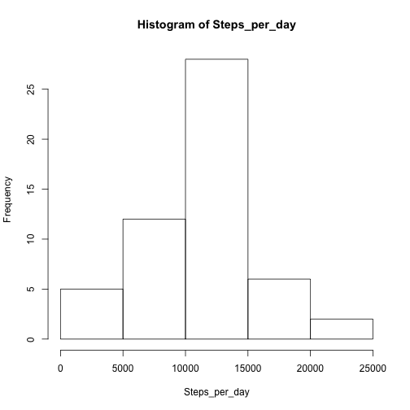
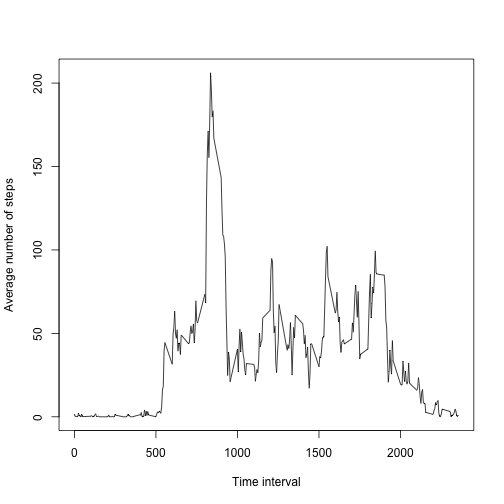
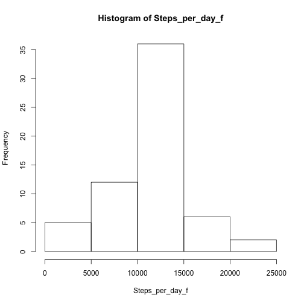

## Pre-processing

### Load libraries


```r
library(dplyr)
```

```
## Warning: package 'dplyr' was built under R version 3.1.2
```

```
## 
## Attaching package: 'dplyr'
## 
## The following object is masked from 'package:stats':
## 
##     filter
## 
## The following objects are masked from 'package:base':
## 
##     intersect, setdiff, setequal, union
```

## Loading and preprocessing the data

### 1. Load the data


```r
data <- read.csv("./data/activity.csv", header=TRUE)
```

### 2. Process/transform the data

N/A

## What is mean total number of steps taken per day?

### 1. Calculate the total number of steps taken per day


```r
by_date <- group_by(data, date)
sum_date <- summarize(by_date, sum(steps))
```

### 2. Make a histogram of the total number of steps taken each day


```r
Steps_per_day <- as.matrix(sum_date[,2])
hist(Steps_per_day)
```

 

### 3. Calculate and report the mean and median of the total number of steps taken per day


```r
mean_day <- mean(Steps_per_day, na.rm=TRUE)
print(mean_day)
```

```
## [1] 10766.19
```

```r
median_day <- median(Steps_per_day, na.rm=TRUE)
print(median_day)
```

```
## [1] 10765
```


## What is the average daily activity pattern?

### 1. Make a time series plot


```r
by_time <- group_by(data, interval)
sum_time <- summarize(by_time, mean(steps, na.rm=TRUE))
sum_time$mean_time <- as.matrix(sum_time[,2])
plot(sum_time$interval, sum_time$mean_time, type="l", xlab="Time interval", ylab="Average number of steps")
```

 

### 2. Interval that contain maximum number of steps


```r
n <- which.max(sum_time$mean_time)
sum_time[n,]
```

```
## Source: local data frame [1 x 3]
## 
##   interval mean(steps, na.rm = TRUE) mean_time
## 1      835                  206.1698  206.1698
```


## Imputing missing values

### 1. Total number of missing values


```r
sum(is.na(data$steps))
```

```
## [1] 2304
```

### 2. Strategy for filling in missing values

Decided to use strategy "Use the mean for that day", mean of the total number of steps taken per day devided by the number of time interval per day (288). Following is the calculation for that value.


```r
mean_interval <- mean_day / 288
print(mean_interval)
```

```
## [1] 37.3826
```


### 3. Create a new dataset with missing data filled in, using the strategy stated


```r
data_f <- data
data_f$steps <- replace(data_f$steps, which(is.na(data_f$steps)), mean_interval)
```

### 4. Histogram and mean/median for new dataset

Histogram for new dataset.


```r
by_date_f <- group_by(data_f, date)
sum_date_f <- summarize(by_date_f, sum(steps))
Steps_per_day_f <- as.matrix(sum_date_f[,2])
hist(Steps_per_day_f)
```

 

Mean/median for new dataset.


```r
mean_day_f <- mean(Steps_per_day_f)
print(mean_day_f)
```

```
## [1] 10766.19
```

```r
median_day_f <- median(Steps_per_day_f)
print(median_day_f)
```

```
## [1] 10766.19
```


## Are there differences in activity patterns between weekdays and weekends?

### 1. Create new factor variable, with "weekday" and "weekend"


```r
data_f$date <- as.POSIXlt(data_f$date)
data_f$weekdays <- weekdays(data_f$date)

data_f$weekdayt <- "weekday"
data_f$weekdayt[data_f$weekdays %in% c("日曜日", "土曜日")]<-"weekend"
data_f$weekdayt <- as.factor(data_f$weekdayt)
```

### 2. Make a panel plot for weekdays and weekends


```r
data_f_we <- subset(data_f, weekdayt == "weekend")
by_time_f_we <- group_by(data_f_we, interval)
```

```
## Error in eval(expr, envir, enclos): column 'date' has unsupported type : POSIXlt, POSIXt
```

```r
sum_time_f_we <- summarize(by_time_f_we, mean(steps))
```

```
## Error in summarise_(.data, .dots = lazyeval::lazy_dots(...)):  オブジェクト 'by_time_f_we' がありません
```

```r
sum_time_f_we$mean_time <- as.matrix(sum_time_f_we[,2])
```

```
## Error in as.matrix(sum_time_f_we[, 2]):  オブジェクト 'sum_time_f_we' がありません
```

```r
data_f_wd <- subset(data_f, weekdayt == "weekday")
by_time_f_wd <- group_by(data_f_wd, interval)
```

```
## Error in eval(expr, envir, enclos): column 'date' has unsupported type : POSIXlt, POSIXt
```

```r
sum_time_f_wd <- summarize(by_time_f_wd, mean(steps))
```

```
## Error in summarise_(.data, .dots = lazyeval::lazy_dots(...)):  オブジェクト 'by_time_f_wd' がありません
```

```r
sum_time_f_wd$mean_time <- as.matrix(sum_time_f_wd[,2])
```

```
## Error in as.matrix(sum_time_f_wd[, 2]):  オブジェクト 'sum_time_f_wd' がありません
```

```r
plot(sum_time_f_we$interval, sum_time_f_we$mean_time, type="l", xlab="Time interval", ylab="Average number of steps", main="Weekend")
```

```
## Error in plot(sum_time_f_we$interval, sum_time_f_we$mean_time, type = "l", :  オブジェクト 'sum_time_f_we' がありません
```

```r
plot(sum_time_f_wd$interval, sum_time_f_wd$mean_time, type="l", xlab="Time interval", ylab="Average number of steps", main="Weekday")
```

```
## Error in plot(sum_time_f_wd$interval, sum_time_f_wd$mean_time, type = "l", :  オブジェクト 'sum_time_f_wd' がありません
```
